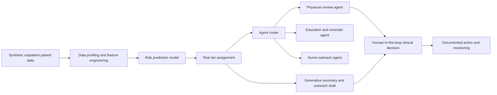

# System Architecture: AI-Assisted Chronic Care Triage

## Industry and Use Case
This project targets **healthcare**, specifically outpatient follow-up for adults with **Type 2 diabetes and related chronic-risk indicators**. The system is designed to help clinics identify patients who may need faster outreach while keeping a human clinician in the loop for high-stakes decisions.

## Integrated Components

| Component | Role in the system | Capstone domain represented |
| --- | --- | --- |
| Exploratory data analysis | Profiles A1C, blood pressure, adherence, and utilization patterns | Data/statistical reasoning |
| Predictive risk model | Estimates the probability that a patient needs near-term intervention | Machine learning |
| Generative explanation layer | Produces a readable summary and recommended outreach message | Generative AI |
| Routing logic | Directs each case to the right follow-up path or human review | Agentic AI workflows |

## End-to-End Flow

## Design Boundaries
- The artifact is a **prototype and case study**, not a deployed clinical device.
- The dataset is **synthetic**, so no real patient information is exposed.
- The model **supports prioritization**, but it does **not replace diagnosis or treatment planning**.
- High-risk outputs are intentionally routed to **human review** to reduce automation risk.

## Tradeoffs
1. **Interpretability over complexity**: a logistic model is easier to explain than a black-box alternative.
2. **Safety over autonomy**: the agent layer recommends actions, but clinicians retain authority.
3. **Speed over exhaustiveness**: the first version focuses on a small set of structured variables rather than full EHR integration.

## Responsible AI Safeguards
- Human review for high-risk cases
- Use of synthetic data in the prototype stage
- Clear disclosure of model limitations
- Monitoring for false negatives and group-level disparities
- Alignment with risk-management and healthcare ethics guidance
