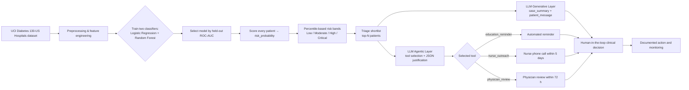

# System Architecture: AI-Assisted Chronic Care Triage

## Industry and Use Case
This project targets **healthcare**, specifically outpatient follow-up for adults with **diabetes and related chronic-risk indicators**. The system is designed to help clinics identify patients who are likely to need faster outreach (operationally proxied by 30-day readmission risk) while keeping a human clinician in the loop for high-stakes decisions.

The artifact runs against the **UCI Diabetes 130-US Hospitals (1999-2008) dataset**, a publicly available record of ~100,000 inpatient encounters across 130 U.S. hospitals (Strack et al., 2014).

## Integrated Components

| Component | Role in the system | Technique used | Capstone domain represented |
| --- | --- | --- | --- |
| Data analysis layer | Loads and cleans the UCI dataset, defines the `needs_intervention = (readmitted < 30 days)` target, and engineers numeric and categorical features | pandas pipelines, sentinel/missing handling, age-band → midpoint encoding | Data and statistical reasoning |
| Predictive risk model | Estimates the probability that a patient will be readmitted within 30 days; selects between a logistic regression and a random forest by held-out ROC-AUC | scikit-learn `Pipeline`, `ColumnTransformer`, `StandardScaler`, `OneHotEncoder`, stratified train/test split, class-weight balancing, ROC-AUC + precision/recall/F1 reporting | Supervised machine learning |
| Generative explanation layer | Produces a short clinical case summary and a separate plain-language patient outreach message for each shortlisted patient | LLM (OpenAI by default; Anthropic and local `llama-cpp-python` GGUF models also supported) called with constrained system prompts ("never diagnose, never invent indicators") | Generative AI |
| Agentic routing layer | Reads the patient context, considers a fixed tool set, selects exactly one follow-up tool, and returns a JSON decision with action, justification, and follow-up window | Same LLM acting as a tool-using agent with structured-output prompting, JSON-mode response, validation against an allow-list, and conservative fallback to physician review when output cannot be parsed | Agentic AI workflows |

## End-to-End Flow

## LLM Backend Selection
The `LLMClient` class chooses a backend at startup, in this priority order:

1. **OpenAI** Chat Completions API (env `OPENAI_API_KEY`, default model `gpt-4o-mini`).
2. **Anthropic** Messages API (env `ANTHROPIC_API_KEY`, default model `claude-3-5-haiku-latest`).
3. **Local `llama-cpp-python`** with a GGUF model (env `LOCAL_LLM_GGUF` pointing to a local file).

If none of these are configured, the system **raises** rather than silently falling back to string templates. This is an explicit design choice: the rubric requires the generative and agentic layers to be implemented with real AI techniques, and pretending to satisfy that requirement with a deterministic template would be worse than failing loudly.

## Agent Tool Set
The agentic layer chooses exactly one of the following tools for each shortlisted patient:

- `education_reminder` — automated educational reminder for stable, lower-risk patients with no recent acute utilization.
- `nurse_outreach` — nurse phone call within five business days for moderate-risk patients or those with recent missed care.
- `physician_review` — escalation to a physician for review and possible expedited visit within 72 hours, for high-risk patients or those with multiple acute utilization signals.

The agent must return strict JSON with `action`, `justification`, and `follow_up_hours`. The action is validated against the allow-list above; invalid or unparsable output triggers one retry at temperature 0 and, if that also fails, a conservative escalation to `physician_review` with an explanatory justification.

## Design Boundaries
- The artifact is a **prototype and case study**, not a deployed clinical device.
- The dataset is **real but historical** (U.S. inpatient encounters 1999-2008). Generalization to current outpatient populations is not assumed.
- The model **supports prioritization**, not diagnosis or treatment planning.
- High-risk and ambiguous outputs are intentionally routed to **human review** to reduce automation risk.

## Tradeoffs
1. **Real-data complexity over inflated metrics**: switching from synthetic to real data lowered the headline ROC-AUC, but the evaluation now actually measures generalization.
2. **Two model classes side by side**: logistic regression contributes interpretability, random forest contributes non-linear capacity; the better held-out ROC-AUC wins.
3. **Percentile-based risk bands over fixed thresholds**: bands adapt to whatever calibration the chosen model produces, which matches finite triage capacity in a real clinic.
4. **Constrained LLM use over open-ended generation**: prompts forbid diagnosis and invention of indicators, the agent's action space is closed, and JSON output is validated.
5. **Bounded LLM cost**: the classifier scores all ~99k patients, but the LLM layers run only on a configurable triage shortlist (default 20 patients).

## Responsible AI Safeguards
- Human review for high-risk cases and for any case the agent cannot route confidently.
- Real but de-identified dataset, with explicit acknowledgement that any production system would require a separate governance and privacy review for live patient data and for what is sent to a third-party LLM provider.
- Clear disclosure of model limitations (historical data, mid-0.6 ROC-AUC, false-negative risk).
- LLM prompts that forbid diagnosis, prescription, and invented indicators.
- Validated, allow-listed action space for the agent.
- Alignment with NIST AI RMF and WHO ethics guidance for health AI.
